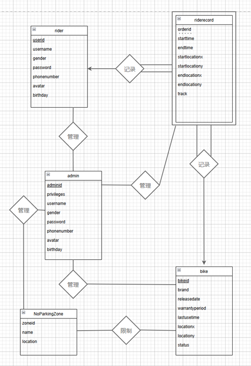

# SharedBikeDatabaseSystem

SharedBikeDatabaseSystem 是一个基于关系数据库的单车管理系统，为共享单车企业提供了便捷的单车管理平台，同时实现了高效的数据存储和分析。系统支持单车信息、骑行记录、禁停区的管理，并具备数据增删查改和权限控制功能。用户可以通过友好的Web界面进行操作，并利用数据分析功能优化单车调度和业务决策。通过该系统，共享单车企业能够提升运营效率，改善服务质量。

## 使用方法

##### 前端端口为5173，后端端口为8088

安装部署：

初始的数据库产生使用**/Mysql表**内的**backend.sql**生成；

后端使用IDEA2024.1 

java jdk版本为openjdk22.01 maven自动安装依赖，运行主程序即可

前端安装Vue3，在前端目录下执行npm install完成依赖安装，运行npm run dev启动前端；

## **后端数据库（Mysql）部分设计：**

### **实体和属性**

**管理员（Admin）**

*privileges权限（三类）*

*adminid（管理员ID）*

*username（用户名）*

*gender（性别）*

*password（密码）*

*phone_number（手机号）*

*avatar（头像）*

*生日*

**骑行者（Rider）**

*userid（骑行者ID）*

*username（用户名）*

*gender（性别）*

*password（密码）*

*phone_number（手机号）*

*avatar（头像）*

*生日*

**单车（Bike）**

*bikeid（单车ID）*

*brand（品牌）*

*release_date（投放时间）*

*warranty_period（保修时长）*

*status（状态：是否关锁损坏）*

locationx 单车位置

locationy

lastusetime 上次实验时间

**骑行记录（RideRecord）**

*orderid（订单ID）*

*bikeid（单车ID）*

*userid（骑行者ID）*

*start_time（开始时间）*

*start_location_x（起点X坐标）*

*start_location_y（起点Y坐标）*

*end_time（结束时间）*

*end_location_x（终点X坐标）*

*end_location_y（终点Y坐标）*

*track（轨迹）*

**禁停区（NoParkingZone）**

*zoneid（区域ID）*

*name（区域名称）*

*location（位置）*

### **关系**

管理员（Admin）可以增删改查骑行者（Rider）

管理员（Admin）可以增删改查单车（Bike）

管理员（Admin）可以增删改查骑行记录（RideRecord）

管理员（Admin）可以增删改查禁停区（NoParkingZone）

骑行者（Rider）与骑行记录（RideRecord）之间是多对多关系，通过订单（RideRecord）来表示

骑行记录（RideRecord） 是典型的弱实体，因为它依赖于 Bike 和 Rider。它的主要标识 orderid 仅在关联的单车和骑行者存在时才有意义。

### **ER**图：



### **MySQL设计：**

构建这五个表，并且定义一个Trigger，当navicat将Excel数据插入到**RideRecord**表中时，检查**bike**和**rider**表中是否存在对应的**id**，如果不存在就向其添加数据（除id外的数据进行随机初始化）。**NoParkingZone和Admin表不做初始化，之后联系springboot，再做输入定义。

## 后端结构：

```
sharedbike
├── HELP.md
├── mvnw
├── mvnw.cmd
├── pom.xml
├── src
│   ├── main
│   │   ├── java
│   │   │   └── com
│   │   │       └── example
│   │   │           └── sharedbike
│   │   │               ├── Config
│   │   │               │   ├── MyWebMvcConfigurer.java
│   │   │               │   ├── ResponseAdvice.java
│   │   │               │   └── SwaggerConfig.java
│   │   │               ├── Controller
│   │   │               │   ├── AdminController.java
│   │   │               │   ├── BikeController.java
│   │   │               │   ├── FileController.java
│   │   │               │   ├── LoginController.java
│   │   │               │   ├── NoParkingZoneController.java
│   │   │               │   ├── RideRecordController.java
│   │   │               │   ├── RiderController.java
│   │   │               │   ├── SchedulingController.java
│   │   │               │   ├── SchedulingPlan.java
│   │   │               │   └── hello.java
│   │   │               ├── domin
│   │   │               │   └── BaseResponse.java
│   │   │               ├── entity
│   │   │               │   ├── Admin.java
│   │   │               │   ├── Bike.java
│   │   │               │   ├── DTO
│   │   │               │   │   └── AdminUpdateDTO.java
│   │   │               │   ├── Enum
│   │   │               │   │   ├── Gender.java
│   │   │               │   │   └── Status.java
│   │   │               │   ├── NoParkingZone.java
│   │   │               │   ├── Privileges.java
│   │   │               │   ├── RideRecord.java
│   │   │               │   └── Rider.java
│   │   │               ├── jwt
│   │   │               │   ├── JwtFilter.java
│   │   │               │   ├── JwtToken.java
│   │   │               │   └── JwtUtils.java
│   │   │               ├── mapper
│   │   │               │   ├── AdminMapper.java
│   │   │               │   ├── BikeMapper.java
│   │   │               │   ├── NoParkingZoneMapper.java
│   │   │               │   ├── RideRecordMapper.java
│   │   │               │   └── RiderMapper.java
│   │   │               ├── result
│   │   │               │   ├── LoginException.java
│   │   │               │   └── Result.java
│   │   │               ├── service
│   │   │               │   ├── AdminService.java
│   │   │               │   ├── CustomExceptionHandler.java
│   │   │               │   ├── RestExceptionHandler.java
│   │   │               │   └── RideRecordService.java
│   │   │               ├── sharebikeApplication.java
│   │   │               └── shiro
│   │   │                   ├── JwtCredentialsMatcher.java
│   │   │                   ├── JwtRealm.java
│   │   │                   ├── MultiRealmAuthenticator.java
│   │   │                   ├── PasswordEncryption.java
│   │   │                   ├── ShiroConfig.java
│   │   │                   └── ShiroRealm.java
│   │   └── resources
│   │       ├── application.properties
│   │       ├── applicatonContext.xml
│   │       ├── mapper
│   │       │   ├── AdminMapper.xml
│   │       │   ├── BikeMapper.xml
│   │       │   ├── NoParkZoneMapper.xml
│   │       │   ├── RideRecordMapper.xml
│   │       │   └── RiderMapper.xml
│   │       └── static
│   │           └── login.html
│   └── test
│       └── java
│           └── com
│               └── example
│                   └── sharedbike
│                       └── sharebikeApplicationTests.java

```

## 项目前端部分结构

```
BikeSystemFrontend
├─.gitignore
├─auto-imports.d.ts
├─components.d.ts
├─env.d.ts
├─index.html
├─package-lock.json
├─package.json
├─tsconfig.app.json
├─tsconfig.json
├─tsconfig.node.json
├─tsconfig.vitest.json
├─vite.config.ts
├─vitest.config.ts
├─src
|  ├─App.vue
|  ├─auto-imports.d.ts
|  ├─components.d.ts
|  ├─global.scss
|  ├─main.ts
|  ├─views
|  |   ├─AdminView.vue
|  |   ├─BikeView.vue
|  |   ├─MapPanel.vue
|  |   ├─NoParkingView.vue
|  |   ├─PersonHome.vue
|  |   ├─RecordView.vue
|  |   └RiderView.vue
|  ├─utils
|  |   ├─http.ts
|  |   └request.ts
|  ├─types
|  |   ├─admin.ts
|  |   ├─bike.ts
|  |   ├─error.ts
|  |   ├─form.ts
|  |   ├─location.ts
|  |   ├─noParkingZone.ts
|  |   ├─record.ts
|  |   ├─rider.ts
|  |   └table.ts
|  ├─stores
|  |   ├─bikes.ts
|  |   ├─mapStatus.ts
|  |   ├─noParkingZone.ts
|  |   ├─operationStatus.ts
|  |   ├─records.ts
|  |   ├─rider.ts
|  |   └user.ts
|  ├─router
|  |   └index.ts
|  ├─components
|  |     ├─ColdBikeChart.vue
|  |     ├─EditForm.vue
|  |     ├─HelloWorld.vue
|  |     ├─HotAreaTimePicker.vue
|  |     ├─HotBikeChart.vue
|  |     ├─InsertForm.vue
|  |     ├─LineChart1.vue
|  |     ├─LocationSelect.vue
|  |     ├─MapContainer.vue
|  |     ├─MapContainerForNoParkingZone.vue
|  |     ├─NavBar.vue
|  |     ├─SchedulingPlan.vue
|  |     ├─SwitchAppearence.vue
|  |     ├─Table.vue
|  |     ├─TimeChart.vue
|  |     ├─TimeSelect.vue
|  |     ├─WelcomeItem.vue
|  |     ├─__tests__
|  |     |     └HelloWorld.spec.ts
|  |     ├─icons
|  |     |   ├─IconCommunity.vue
|  |     |   ├─IconDocumentation.vue
|  |     |   ├─IconEcosystem.vue
|  |     |   ├─IconSupport.vue
|  |     |   └IconTooling.vue
|  ├─assets
|  |   ├─base.css
|  |   ├─logo.svg
|  |   └main.css
|  ├─api
|  |  └request.ts
├─public
|   ├─chuchu.jpg
|   ├─default.jpg
|   ├─favicon (1).ico
|   ├─img
|   |  ├─mass0.png
|   |  └mass1.png
```

## 项目技术栈

前端：Vue3 + TypeScript + Vite + element UI
后端：Spring Boot + MyBatis + Mysql

## 项目特色

- 采用前后端分离的架构，前端使用Vue3，后端使用Spring Boot
- 前端使用Vite作为构建工具，开发效率高
- 前端使用TypeScript，代码更加规范，可读性更高
- 前端使用 element UI作为UI框架，界面美观，交互友好
- 后端使用MyBatis作为ORM框架，代码简洁，易于维护
- 后端使用JWT结合Shiro框架作为认证方式，保证用户信息安全
- 后端使用Swagger作为API文档生成工具，方便前后端对接

## 项目功能

- 用户登录以及系统管理员注册新的用户
- 针对骑行者，单车，骑行记录，禁停区的增删改查
- 骑行记录和禁停区的地图显示效果，以及禁停区的区域边界编辑功能
- 空闲单车位置统计，调度方案生成，单车使用时间段统计图，单车使用频繁度排行等数据分析功能
